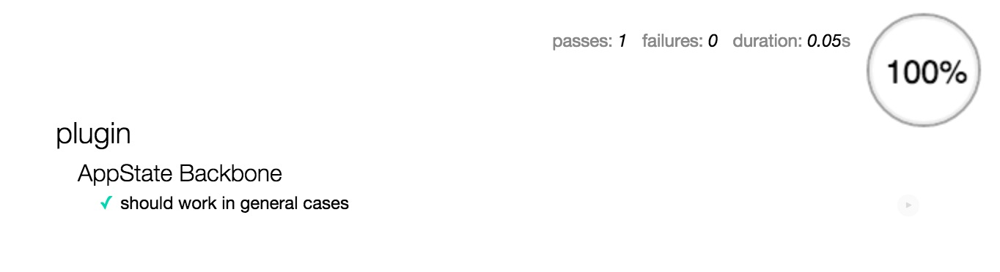

JS Plugin TDD Boilerplate
====================

JS Plugin TDD Boilerplate is a quick starter for build your frontend plugin with TDD unit tests suit. e.g. jquery/underscore/backbone

FE tooling spec: grunt+mocha+chai+sinon+browserify+testem



## Setup

```
npm install
grunt build
```

For development purpose:
- To code plugin: `grunt dev` to live watch your code and `grunt build` to compile your code for client usage(jshint, jscs, browserfy, uglify)  
- To test plugin: `npm test` or `testem`

_PS. tests might fail in phantomjs if test code has fn.bind, becuase it doesn't support Funciton.prototype.bind since it's build with QTwebkit. you can either polyfill the bind or just use a real browser (the .bind is used in the spec to validate params)_

## Todo: 

- Webpack?
- browserSync
- code coverage
- jscs check, git precommit hook
- add CI

## Credits
 
- [Testem with Mocha, Chai, Sinon setup](http://www.kenpowers.net/blog/testing-in-browsers-and-node/)
- https://github.com/paulgrock/testem-blanket-mocha-chai-sinon-plato
- [Browerify + literalify for browser usage](http://truongtx.me/2014/03/20/browserify-bring-nodejs-modules-to-browser/)
